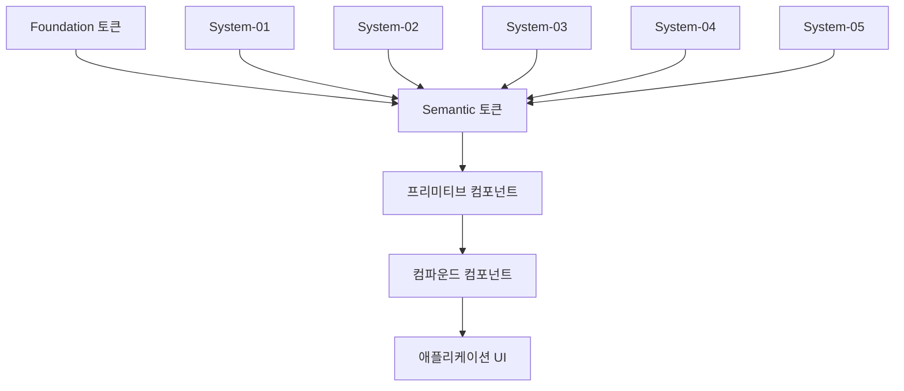

# Lumir 디자인 시스템 개요

## 📝 시스템 철학

Lumir 디자인 시스템은 **일관성**, **확장성**, **접근성**을 핵심 가치로 하는 모노레포 기반의 컴포넌트 라이브러리입니다.

### 핵심 원칙

1. **🔧 프리미티브 우선 (Primitives First)**
   - 모든 복잡한 UI는 8개의 프리미티브 컴포넌트 조합으로 구성
   - 단일 책임 원칙에 따른 명확한 역할 분리
   - 조합 가능성을 통한 무한한 확장성

2. **🎨 토큰 기반 디자인 (Token-Driven Design)**
   - 하드코딩된 값 절대 금지
   - Foundation 토큰 → Semantic 토큰 계층 구조
   - 시스템별 테마 자동 적용

3. **♿ 접근성 우선 (Accessibility First)**
   - WCAG 2.1 AA 기준 자동 준수
   - 색상 대비 4.5:1 이상 보장
   - 키보드 내비게이션 및 스크린 리더 완벽 지원

## 🏗 시스템 구조

### 계층적 아키텍처



### 구성 요소

#### 1. Foundation 토큰 (packages/shared/foundation.json)
- **색상**: 기본 컬러 팔레트 (Blue, Green, Grey, Red, Yellow)
- **간격**: 수치 기반 스페이싱 시스템 (4px 기준)
- **폰트**: 타이포그래피 스케일 및 가중치
- **그림자**: elevation 기반 그림자 시스템
- **테두리**: 반지름 및 두께 시스템

#### 2. Semantic 토큰 (각 시스템별 semantic.json)
- **의미 기반 네이밍**: primary, secondary, cta, error, warning
- **상태별 변화**: rest, hovered, pressed, selected, disabled  
- **시스템별 특화**: 같은 의미, 다른 시각적 표현

#### 3. 프리미티브 컴포넌트 (8개, packages/shared/primitives)
| 컴포넌트 | 책임 | 주요 속성 |
|---------|------|-----------|
| Text | 타이포그래피 | variant, weight, textAlign |
| Icon | 아이콘 표시 | name, size |
| Frame | 레이아웃, 구조 | display, padding, gap, flexbox |
| Surface | 색상, 그림자, 테두리 | background, foreground, boxShadow |
| Interactive | 상호작용 | zIndex, cursor, focusStyle |
| Sizing | 크기, 비율 | width, height, aspectRatio |
| Divider | 구분선 | orientation, thickness, color |
| Asterisk | 필수 표시 | disabled |

#### 4. 컴파운드 컴포넌트 (15개, 각 시스템별)
완성된 UI 컴포넌트로, 프리미티브들의 조합으로 구성

## 🎯 5가지 시스템 테마

### System-01: Professional & Clean
```jsx
// 특성: 직각에 가까운 모서리, 타이트한 간격, 작은 아이콘
<Button variant="filled" colorScheme="primary" size="md">
  GitHub 스타일 버튼
</Button>
```
- **색상**: Blue 기반 (`blue.light.50`)
- **모서리**: sm radius (4px)
- **간격**: sm, md 위주
- **용도**: GitHub, 백오피스, 엔터프라이즈

### System-02: Friendly & Bright
```jsx
// 특성: 둥근 모서리, 여유로운 간격, 큰 아이콘
<Button variant="filled" colorScheme="primary" size="md">
  커머스 스타일 버튼
</Button>
```
- **색상**: Green 기반 (`green.light.50`)
- **모서리**: xl radius (12px)
- **간격**: md, lg, xl 위주  
- **용도**: 쇼핑몰, 소비자 대상 서비스

### System-03: Modern & Software (계획됨)
- **특성**: Discord, Slack 스타일
- **색상**: Purple/Dark 기반
- **용도**: 개발자 도구, 커뮤니케이션 앱

### System-04: Aerospace Control (계획됨)
- **특성**: 미션 크리티컬 제어 시스템
- **색상**: High contrast, 경고색 중심
- **용도**: 위성 제어, 항공 관제

### System-05: Aerospace Dashboard (계획됨)
- **특성**: 데이터 시각화 중심
- **색상**: 차트 친화적 팔레트
- **용도**: 모니터링 대시보드, 분석 도구

## 💻 사용 패턴

### 프리미티브 조합 예시

```jsx
// 카드 형태의 UI 구성
<Surface 
  background="secondary-system01-1-rest"
  borderRadius="card"
  boxShadow="20"
>
  <Interactive cursor="pointer" hoverElevation>
    <Frame padding="lg" display="flex" direction="column" gap="md">
      {/* 헤더 */}
      <Frame display="flex" justify="space-between" align="center">
        <Text variant="title-2" weight="bold">카드 제목</Text>
        <Icon name="arrow-right" size="sm" />
      </Frame>
      
      {/* 내용 */}
      <Text variant="body-2">카드 설명 텍스트입니다.</Text>
      
      {/* 구분선 */}
      <Divider orientation="horizontal" spacing="sm" />
      
      {/* 액션 영역 */}
      <Frame display="flex" justify="flex-end" gap="sm">
        <Text variant="caption-1">2024.01.15</Text>
      </Frame>
    </Frame>
  </Interactive>
</Surface>
```

### 컴파운드 컴포넌트 사용 예시

```jsx
// 완성된 컴포넌트 사용
<Card
  title="상품명"
  description="브랜드명"
  imageUrl="/product.jpg"
  showBadge
  badge={{ text: "NEW", color: "success" }}
  showActionButton
  actionButton={{ 
    text: "구매하기", 
    onClick: handlePurchase,
    iconName: "cart"
  }}
  onClick={handleCardClick}
/>
```

## 🔄 반응형 시스템

모든 프리미티브 컴포넌트는 반응형 props을 지원합니다:

```jsx
<Text 
  variant={{
    mobile: 'body-1',
    tablet: 'heading-3', 
    desktop: 'title-1'
  }}
  textAlign={{
    mobile: 'center',
    desktop: 'left'
  }}
>
  반응형 텍스트
</Text>

<Frame 
  display="flex"
  direction={{ mobile: 'column', desktop: 'row' }}
  gap={{ mobile: 'sm', desktop: 'lg' }}
  padding={{ mobile: 'md', desktop: 'xl' }}
>
  반응형 레이아웃
</Frame>
```

## 📦 패키지 구조

```
lumir-design-system/
├── packages/
│   ├── shared/                 # 공통 프리미티브
│   │   ├── foundation.json     # Foundation 토큰
│   │   ├── icons/             # 아이콘 라이브러리 (293개)
│   │   └── src/primitives/    # 8개 프리미티브 컴포넌트
│   │
│   ├── system-01/             # Professional & Clean
│   │   ├── semantic.json      # System-01 시멘틱 토큰
│   │   └── src/compounds/     # 15개 컴파운드 컴포넌트
│   │
│   ├── system-02/             # Friendly & Bright  
│   │   ├── semantic.json      # System-02 시멘틱 토큰
│   │   └── src/compounds/     # 15개 컴파운드 컴포넌트
│   │
│   └── storybook/             # 문서화 및 테스트
└── docs/                      # 상세 문서
```

## 🛠️ 개발 워크플로우

### 1. 새로운 컴포넌트 추가 시

```bash
# 1. 프리미티브로 해결 가능한지 확인
# 2. 기존 컴파운드 컴포넌트 확장 가능한지 검토
# 3. 새로운 컴파운드 컴포넌트 필요 시 추가
```

### 2. 새로운 시스템 테마 추가 시

```bash
# 1. semantic.json 파일 생성
# 2. 시스템별 토큰 매핑 정의  
# 3. 컴파운드 컴포넌트 스타일 적용
# 4. 스토리북 문서 추가
```

## ✅ 품질 기준

### 자동 검증 항목

- **토큰 사용**: 하드코딩된 값 감지 및 차단
- **접근성**: 색상 대비, 키보드 접근성 자동 검사
- **타입 안전성**: TypeScript strict 모드 준수
- **성능**: 번들 크기, 렌더링 성능 모니터링

### 수동 검증 항목

- **디자인 일관성**: 시스템 내 컴포넌트 간 일관성 확인
- **사용성**: 개발자 친화적 API 설계
- **문서화**: 모든 컴포넌트 스토리북 및 문서 완비

## 🔍 다음 단계

이 개요를 읽었다면, 다음 문서들을 순서대로 학습하세요:

1. **[토큰 시스템](./02-토큰시스템.md)** - 색상, 간격, 폰트 등 디자인 토큰 체계
2. **[디자인 규칙](./03-디자인규칙.md)** - 반드시 지켜야 할 개발 규칙
3. **[프리미티브 개요](../02-primitives/00-개요.md)** - 8개 기본 컴포넌트 이해
4. **[조합 패턴](../05-guides/01-조합패턴.md)** - 실제 사용 패턴 학습

## ❓ 자주 묻는 질문

**Q: 왜 8개의 프리미티브로 제한했나요?**
A: 각 프리미티브가 명확한 단일 책임을 가지도록 하여, 조합의 복잡성을 줄이고 일관성을 보장하기 위함입니다.

**Q: 새로운 시스템 테마는 언제 추가되나요?**
A: System-03부터 System-05는 2024년 하반기에 순차적으로 출시 예정입니다.

**Q: 다른 프레임워크(Vue, Angular)에서도 사용 가능한가요?**
A: 현재는 React 전용이지만, 토큰 시스템과 디자인 원칙은 다른 프레임워크에서도 적용 가능합니다.

---

**관련 문서**  
→ [토큰 시스템](./02-토큰시스템.md)  
→ [디자인 규칙](./03-디자인규칙.md)  
→ [프리미티브 개요](../02-primitives/00-개요.md)

**문서 개선 제안**  
이 문서에서 부족한 내용이나 개선이 필요한 부분이 있다면 GitHub Issues로 알려주세요. 