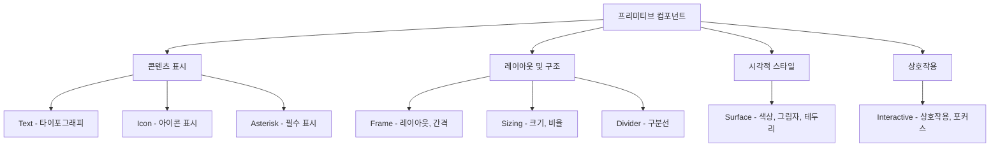

# 프리미티브 컴포넌트 개요

## 📝 프리미티브 철학

Lumir 디자인 시스템의 핵심은 **8개의 프리미티브 컴포넌트**입니다. 각 프리미티브는 명확한 단일 책임을 가지며, 이들의 조합을 통해 모든 복잡한 UI를 구성할 수 있습니다.

### 핵심 원칙

1. **🔧 단일 책임 원칙 (Single Responsibility)**
   - 각 프리미티브는 하나의 명확한 역할만 담당
   - 역할 간 중복 없음
   - 최소한의 API로 최대한의 유연성 제공

2. **🧩 조합 가능성 (Composability)**
   - 모든 프리미티브는 자유롭게 조합 가능
   - 중첩과 조합을 통한 복잡한 UI 구성
   - 일관된 API 패턴으로 학습 용이성 보장

3. **🎯 일관성 보장 (Consistency)**
   - 모든 시스템에서 동일한 프리미티브 사용
   - Props 인터페이스의 일관성
   - 예측 가능한 동작 패턴

## 🏗 8개 프리미티브 컴포넌트

### 구조적 분류



### 각 프리미티브별 역할

| 컴포넌트 | 책임 영역 | 주요 Props | 사용 빈도 |
|---------|-----------|-----------|-----------|
| **Text** | 모든 텍스트 렌더링 | `variant`, `weight`, `textAlign` | 매우 높음 ⭐⭐⭐⭐⭐ |
| **Icon** | 아이콘 표시 (293개) | `name`, `size` | 높음 ⭐⭐⭐⭐ |
| **Frame** | 레이아웃, 간격, Flexbox | `display`, `padding`, `gap` | 매우 높음 ⭐⭐⭐⭐⭐ |
| **Surface** | 색상, 그림자, 테두리 | `background`, `foreground`, `boxShadow` | 높음 ⭐⭐⭐⭐ |
| **Interactive** | 상호작용, 포커스, 커서 | `cursor`, `focusStyle`, `zIndex` | 중간 ⭐⭐⭐ |
| **Sizing** | 크기, 비율, 반응형 | `width`, `height`, `aspectRatio` | 중간 ⭐⭐⭐ |
| **Divider** | 구분선, 여백 | `orientation`, `thickness`, `spacing` | 낮음 ⭐⭐ |
| **Asterisk** | 필수 입력 표시 | `disabled` | 낮음 ⭐ |

## 💻 기본 사용 패턴

### 1. 단일 프리미티브 사용

```jsx
// 간단한 텍스트 표시
<Text variant="title-1" weight="bold">
  제목 텍스트
</Text>

// 아이콘 표시
<Icon name="heart" size="md" />

// 레이아웃 컨테이너
<Frame padding="lg" display="flex" gap="md">
  <Text>항목 1</Text>
  <Text>항목 2</Text>
</Frame>
```

### 2. 프리미티브 조합 - 기본 패턴

```jsx
// 텍스트 + 배경색 조합
<Surface background="primary-system01-1-rest">
  <Frame padding="md">
    <Text variant="label-1" weight="medium">
      색상이 있는 텍스트
    </Text>
  </Frame>
</Surface>

// 아이콘 + 텍스트 조합
<Frame display="flex" align="center" gap="sm">
  <Icon name="plus" size="sm" />
  <Text variant="body-2">새 항목 추가</Text>
</Frame>

// 크기 제한 + 내용 구성
<Sizing width="300px" height="200px">
  <Surface background="secondary-system01-2-rest" borderRadius="md">
    <Frame padding="lg" display="flex" align="center" justify="center">
      <Text variant="heading-2" textAlign="center">
        고정 크기 카드
      </Text>
    </Frame>
  </Surface>
</Sizing>
```

### 3. 복잡한 조합 - 실제 UI 구성

```jsx
// 버튼 형태의 복합 컴포넌트
const CustomButton = ({ children, onClick, variant = "primary" }) => (
  <Interactive cursor="pointer" onClick={onClick} focusStyle="ring">
    <Surface 
      background={`${variant}-system01-1-rest`}
      borderRadius="sm"
      boxShadow="10"
    >
      <Frame 
        padding="sm" 
        display="flex" 
        align="center" 
        justify="center" 
        gap="xs"
      >
        <Icon name="check" size="sm" />
        <Text variant="label-1" weight="medium">
          {children}
        </Text>
      </Frame>
    </Surface>
  </Interactive>
);

// 카드 형태의 복합 컴포넌트
const InfoCard = ({ title, description, imageUrl }) => (
  <Sizing maxWidth="400px">
    <Surface 
      background="secondary-system01-3-rest"
      borderRadius="md" 
      boxShadow="20"
    >
      <Frame display="flex" direction="column">
        {/* 이미지 영역 */}
        <Sizing height="200px" aspectRatio="2:1">
          <Surface 
            background="secondary-system01-1-rest"
            borderRadius="md md none none"
          >
            <Frame 
              padding="lg" 
              display="flex" 
              align="center" 
              justify="center"
            >
              <Text variant="caption-1">이미지 영역</Text>
            </Frame>
          </Surface>
        </Sizing>
        
        {/* 내용 영역 */}
        <Frame padding="lg" display="flex" direction="column" gap="sm">
          <Text variant="heading-2" weight="bold">
            {title}
          </Text>
          
          <Divider orientation="horizontal" spacing="sm" />
          
          <Text variant="body-2">
            {description}
          </Text>
          
          {/* 필수 표시 */}
          <Frame display="flex" align="center" gap="xs">
            <Text variant="caption-1">필수 항목</Text>
            <Asterisk />
          </Frame>
        </Frame>
      </Frame>
    </Surface>
  </Sizing>
);
```

## 🎨 시스템별 적용 차이점

### System-01 (Professional & Clean) 조합 패턴

```jsx
// System-01 특성: 타이트한 간격, 작은 아이콘, 최소한의 그림자
<Surface 
  background="primary-system01-1-rest"
  borderRadius="sm"           // 직각에 가까운 모서리
  boxShadow="10"             // 미세한 그림자
>
  <Frame 
    padding="sm"              // 타이트한 간격
    display="flex" 
    align="center" 
    gap="xs"                  // 작은 간격
  >
    <Icon name="settings" size="sm" />  {/* 작은 아이콘 */}
    <Text variant="label-1" weight="medium">설정</Text>
  </Frame>
</Surface>
```

### System-02 (Friendly & Bright) 조합 패턴

```jsx
// System-02 특성: 여유로운 간격, 큰 아이콘, 적극적인 그림자
<Surface 
  background="primary-system02-1-rest"
  borderRadius="xl"           // 둥근 모서리
  boxShadow="30"             // 명확한 그림자
>
  <Frame 
    padding="lg"              // 여유로운 간격
    display="flex" 
    align="center" 
    gap="md"                  // 큰 간격
  >
    <Icon name="settings" size="md" />  {/* 큰 아이콘 */}
    <Text variant="label-1" weight="medium">설정</Text>
  </Frame>
</Surface>
```

## 📏 반응형 조합 패턴

### 반응형 레이아웃 구성

```jsx
// 모바일/데스크톱 반응형 카드 그리드
<Frame 
  display="grid"
  gridTemplateColumns={{
    mobile: '1fr',
    tablet: 'repeat(2, 1fr)',
    desktop: 'repeat(3, 1fr)'
  }}
  gap={{
    mobile: 'sm',
    desktop: 'lg'
  }}
  padding={{
    mobile: 'md',
    desktop: 'xl'
  }}
>
  {items.map(item => (
    <Sizing 
      key={item.id}
      minHeight="250px"
      aspectRatio={{ mobile: '1:1', desktop: '4:3' }}
    >
      <Surface 
        background="secondary-system01-2-rest"
        borderRadius="md"
        boxShadow="20"
      >
        <Interactive cursor="pointer" focusStyle="ring">
          <Frame 
            padding={{ mobile: 'md', desktop: 'lg' }}
            display="flex" 
            direction="column"
            gap="sm"
            height="100%"
          >
            <Text 
              variant={{
                mobile: 'body-1',
                desktop: 'heading-2'
              }}
              weight="bold"
            >
              {item.title}
            </Text>
            
            <Text 
              variant="body-2"
              textAlign={{ mobile: 'center', desktop: 'left' }}
            >
              {item.description}
            </Text>
          </Frame>
        </Interactive>
      </Surface>
    </Sizing>
  ))}
</Frame>
```

### 반응형 내비게이션 패턴

```jsx
// 모바일: 세로 스택, 데스크톱: 가로 배치
<Frame 
  display="flex"
  direction={{ mobile: 'column', desktop: 'row' }}
  align={{ mobile: 'stretch', desktop: 'center' }}
  gap={{ mobile: 'xs', desktop: 'lg' }}
  padding="md"
>
  {navItems.map(item => (
    <Interactive key={item.id} cursor="pointer" focusStyle="ring">
      <Surface 
        background="secondary-system01-1-rest"
        borderRadius="sm"
      >
        <Frame 
          padding={{ mobile: 'sm', desktop: 'md' }}
          display="flex"
          align="center"
          justify={{ mobile: 'flex-start', desktop: 'center' }}
          gap="sm"
        >
          <Icon 
            name={item.icon} 
            size={{ mobile: 'sm', desktop: 'md' }}
          />
          <Text 
            variant={{ mobile: 'body-2', desktop: 'label-1' }}
            weight="medium"
          >
            {item.label}
          </Text>
        </Frame>
      </Surface>
    </Interactive>
  ))}
</Frame>
```

## 🧩 고급 조합 패턴

### 1. 조건부 렌더링 패턴

```jsx
// 상태에 따른 동적 스타일 적용
const StatusCard = ({ status, title, message }) => {
  const getStatusConfig = (status) => {
    switch (status) {
      case 'success':
        return {
          background: 'success-system01-1-rest',
          icon: 'checkmark-circle',
          iconColor: 'success-system01-oncolor'
        };
      case 'error':
        return {
          background: 'error-system01-1-rest',
          icon: 'alert-circle',
          iconColor: 'error-system01-oncolor'
        };
      case 'warning':
        return {
          background: 'warning-system01-1-rest',
          icon: 'alert-triangle',
          iconColor: 'warning-system01-oncolor'
        };
      default:
        return {
          background: 'secondary-system01-2-rest',
          icon: 'info',
          iconColor: 'secondary-system01-oncolor'
        };
    }
  };

  const config = getStatusConfig(status);

  return (
    <Surface 
      background={config.background}
      borderRadius="md"
      boxShadow="20"
    >
      <Frame padding="lg" display="flex" gap="md">
        <Surface 
          background={config.iconColor}
          borderRadius="circular"
          minWidth="32px"
          minHeight="32px"
        >
          <Frame display="flex" align="center" justify="center">
            <Icon name={config.icon} size="sm" />
          </Frame>
        </Surface>
        
        <Frame display="flex" direction="column" gap="xs" flex="1">
          <Text variant="heading-3" weight="bold">
            {title}
          </Text>
          <Text variant="body-2">
            {message}
          </Text>
        </Frame>
      </Frame>
    </Surface>
  );
};
```

### 2. 애니메이션 조합 패턴

```jsx
// Interactive와 Surface를 조합한 애니메이션 버튼
const AnimatedButton = ({ children, onClick, variant = "primary" }) => {
  const [isPressed, setIsPressed] = useState(false);

  return (
    <Interactive 
      cursor="pointer"
      onClick={onClick}
      focusStyle="ring"
      onMouseDown={() => setIsPressed(true)}
      onMouseUp={() => setIsPressed(false)}
      onMouseLeave={() => setIsPressed(false)}
    >
      <Surface 
        background={`${variant}-system01-1-${isPressed ? 'pressed' : 'rest'}`}
        borderRadius="sm"
        boxShadow={isPressed ? '10' : '20'}
        transform={isPressed ? 'translateY(1px)' : 'none'}
        transition="all 0.1s ease"
      >
        <Frame 
          padding="md"
          display="flex" 
          align="center" 
          justify="center"
          gap="sm"
        >
          {children}
        </Frame>
      </Surface>
    </Interactive>
  );
};

// 사용 예시
<AnimatedButton variant="primary" onClick={handleSubmit}>
  <Icon name="plus" size="sm" />
  <Text variant="label-1" weight="medium">추가하기</Text>
</AnimatedButton>
```

### 3. 접근성 강화 패턴

```jsx
// 접근성을 고려한 인터랙티브 리스트
const AccessibleList = ({ items, onItemSelect }) => (
  <Frame display="flex" direction="column" gap="xs">
    {items.map((item, index) => (
      <Interactive
        key={item.id}
        cursor="pointer"
        focusStyle="ring"
        onClick={() => onItemSelect(item)}
        onKeyDown={(e) => {
          if (e.key === 'Enter' || e.key === ' ') {
            e.preventDefault();
            onItemSelect(item);
          }
        }}
        role="button"
        tabIndex={0}
        aria-label={`${item.title} 선택`}
      >
        <Surface 
          background="secondary-system01-2-rest"
          hoverBackground="secondary-system01-2-hovered"
          borderRadius="sm"
          minHeight="44px"  // 터치 타겟 크기 보장
        >
          <Frame 
            padding="sm" 
            display="flex" 
            align="center" 
            gap="md"
          >
            <Icon name={item.icon} size="sm" />
            <Text variant="body-1" weight="medium">
              {item.title}
            </Text>
            {item.required && <Asterisk />}
          </Frame>
        </Surface>
      </Interactive>
    ))}
  </Frame>
);
```

## 🔍 프리미티브별 상세 학습 경로

### 권장 학습 순서

1. **[Text](./01-Text.md)** - 가장 기본적이고 자주 사용되는 컴포넌트
2. **[Frame](./03-Frame.md)** - 레이아웃의 핵심, 거의 모든 조합에 사용
3. **[Surface](./04-Surface.md)** - 시각적 스타일링의 핵심
4. **[Icon](./02-Icon.md)** - UI 완성도를 높이는 시각적 요소
5. **[Interactive](./05-Interactive.md)** - 사용자 상호작용 처리
6. **[Sizing](./06-Sizing.md)** - 반응형 및 크기 제어
7. **[Divider](./07-Divider.md)** - UI 구조화 및 구분
8. **[Asterisk](./08-Asterisk.md)** - 특수 목적 컴포넌트

### 조합별 학습 가이드

**기본 조합 (필수)**
- Text + Frame: 기본 텍스트 레이아웃
- Surface + Frame: 색상 배경이 있는 레이아웃  
- Icon + Text: 아이콘이 포함된 텍스트

**중급 조합 (권장)**
- Interactive + Surface + Frame: 클릭 가능한 요소
- Sizing + Surface + Frame: 크기가 제한된 컨테이너
- Frame + Divider: 구조화된 레이아웃

**고급 조합 (심화)**  
- 8개 프리미티브 모두 사용한 복합 컴포넌트
- 조건부 및 동적 스타일 적용
- 복잡한 반응형 레이아웃

## 🔍 다음 단계

프리미티브 개요를 이해했다면, 다음 순서로 학습하세요:

1. **[Text 컴포넌트](./01-Text.md)** - 타이포그래피의 모든 것
2. **[Frame 컴포넌트](./03-Frame.md)** - 레이아웃과 간격 제어
3. **[Surface 컴포넌트](./04-Surface.md)** - 색상과 시각적 스타일
4. **[조합 패턴 가이드](../05-guides/01-조합패턴.md)** - 실전 조합 패턴

## ❓ 자주 묻는 질문

**Q: 프리미티브를 8개로 제한한 이유는 무엇인가요?**
A: 각 프리미티브가 명확한 단일 책임을 가지도록 하여, 학습 비용을 줄이고 조합의 예측 가능성을 높이기 위함입니다.

**Q: 새로운 프리미티브를 추가할 수 있나요?**
A: 8개 프리미티브로 표현할 수 없는 기능이 있다면 신중한 검토 후 추가 가능하지만, 기존 조합으로 해결 가능한지 먼저 확인해야 합니다.

**Q: 컴파운드 컴포넌트와 프리미티브 조합의 차이는?**
A: 컴파운드 컴포넌트는 자주 사용되는 조합을 미리 정의한 것이고, 프리미티브 조합은 필요에 따라 자유롭게 구성하는 것입니다.

---

**관련 문서**  
→ [시스템 개요](../01-core/01-개요.md)  
→ [조합 패턴](../05-guides/01-조합패턴.md)  
→ [Text 컴포넌트](./01-Text.md)

**문서 개선 제안**  
프리미티브 관련 질문이나 개선 제안이 있다면 GitHub Issues로 알려주세요. 